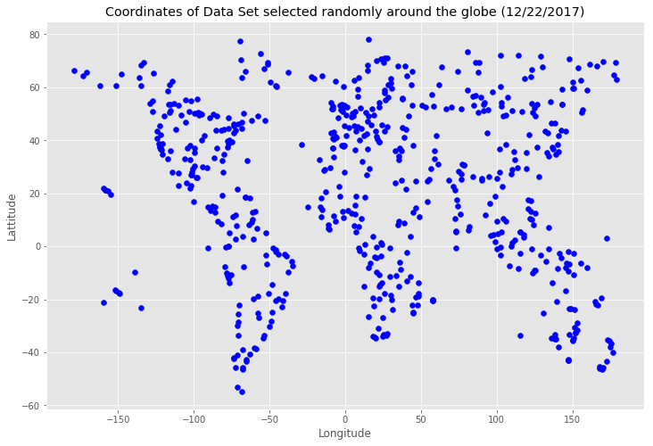
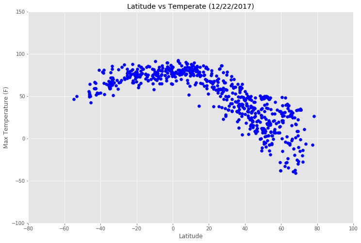
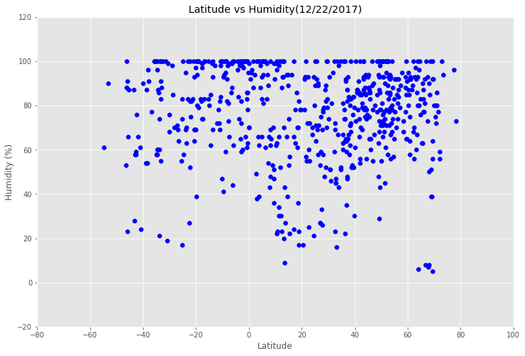
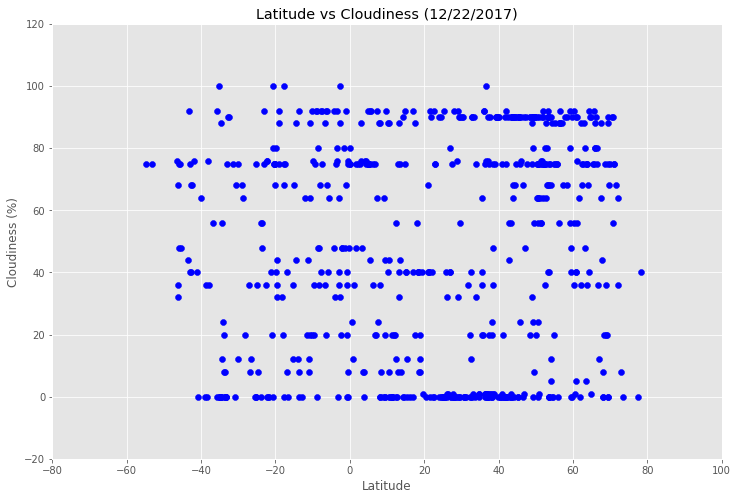
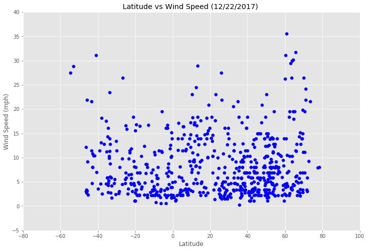

# WeatherPy
 

## Analysis

### Observed - December 22nd 2017

1. Random Selection from the range of coordinates:
   Lattitude between (-90, 90) and 
   Longitude between (-180, 180) 
   gives the shape of the Globe.
   
2. Humidity is at 100% level in many countries that is spread across the lattitude reading of -50 to +80.

3. With Latitude >20, the trend of Temperature is Downwards (the slope) and it reaches to SUB ZERO F level between Latitude from 60 to 80.

4. Cloudiness is spread from 0 to 100% level across the entire range of Latitude. 

5. Majority of the citiies have Wind Speed of from 0 to 5 mph with the latitude ranging from -50 to +80.


```python
# Dependencies
import json
import requests as req
from citipy import citipy 
import random as r 
import numpy as np
import pandas as pd
import seaborn as sns
import matplotlib.pyplot as plt
import csv as cs
plt.style.use('ggplot')
from dateutil import parser
import datetime 
```


```python
# created an API key in a file called 'apikey', 
# in the same directory as this notebook
filename = 'apikey'
```


```python
# Creating a function to keep the apikey save and will not be pushed to github for protection.
def get_file_contents(filename):
    """ Given a filename,
        return the contents of that file
    """
    try:
        with open(filename, 'r') as f:
            # It's assumed our file contains a single line,
            # with our API key
            return f.read().strip()
    except FileNotFoundError:
        print("'%s' file not found" % filename)
```


```python
api_key = get_file_contents(filename)
#print("Our API key is: %s" % (api_key))
```


```python
# Save OpenWeatherMap developer API key and url 
url = "http://api.openweathermap.org/data/2.5/weather?"
units = 'imperial' 
```


```python
# defining Variables to store the extracted data in dictionary
 
city_name = [] 
country = []
date = [] 
lattitude = [] 
longitude =  []
Max_temp =  []
humidity =  []
cloudiness =  []
wind_speed =  []

```


```python
# Generating random numbers with numpy.random.uniform() with different Lat and long  
#to collect the cities around the globe with all details 

lats = np.random.uniform(low=-90.0, high=90.0, size=(1800,))
lngs = np.random.uniform(low=-180.0, high=180.0, size=(1800,)) 
len(lats)
```


    1800


```python
coordinates = []
for i in range(len(lats)):
    coordinates.append((lats[i], lngs[i]))
    
#coordinates
```


```python
# unique value set of cities
city_list = set()

for coord in coordinates:
    lat = coord[0] # first column lattitude
    lng = coord[1] # second column longittude
    
    city = citipy.nearest_city(lat, lng) # calling citipy to get the nearest city
    cityname = city.city_name
    city_list.add(cityname)

mycity_list = list(city_list) # convert the set to list
len(mycity_list)
```


    719


```python
 
#mycity_list
```


```python
# This is to generate the url's for the given city to collect 
#the details from the openweathermap api
 
# also print out the url's for the verification

for city in mycity_list:
    # This is the plot I was using to debug my query, but I do not want to post it to github with my key in it.
    #print('City No ',mycity_list.index(city),' City Name is ',city)
    #print()
    query_url = url + "appid=" + api_key + "&q=" + str(city)+'&units=imperial'
    #print(query_url)
    #print()
    

# This is to collect all the details from openweathermap site using the above generated urls 

    # Get weather data
    owm_data = req.get(query_url).json()
    
     
    # Use try / except to skip any cities with errors
    try:
        country.append(owm_data['sys']['country'])
        date.append(owm_data['dt'])
        city_name.append(owm_data['name'])
        lattitude.append(owm_data['coord']['lat'])
        longitude.append(owm_data['coord']['lon'])
        Max_temp.append(owm_data['main']['temp'])
        cloudiness.append(owm_data['clouds']['all'])
        humidity.append(owm_data['main']['humidity'])
        wind_speed.append(owm_data['wind']['speed'])
        
    except:
        print("Error with city data. Skipping")
        continue

        
#print(own_data)    
```


```python
#  This is to convert All the above collected list into a DataFrame

city_data = pd.DataFrame({'City ': city_name, 
                          'Cloudiness': cloudiness,
                          'Country': country,
                          'Date':date,
                          'Humidity':humidity,
                          'Lat':lattitude,
                          'Lng':longitude,
                          'Max_Temp':Max_temp,
                          'Wind_Speed':wind_speed})
```


```python
# Printing all the values of the extracted data length 
print('city_name = ', len(city_name))
print('country = ', len(country) )
print('date = ', len(date))
print('lattitude = ', len(lattitude))
print('longitude = ', len(longitude) )
print('Max_temp = ', len(Max_temp))
print('humidity = ',  len(humidity))
print('cloudiness = ', len(cloudiness))
print('wind_speed = ', len(wind_speed))

```

    city_name =  634
    country =  634
    date =  634
    lattitude =  634
    longitude =  634
    Max_temp =  634
    humidity =  634
    cloudiness =  634
    wind_speed =  634


```python
# viewing the data frame 
city_data.reset_index()
city_data.head()
```


<div>
<style>
    .dataframe thead tr:only-child th {
        text-align: right;
    }

    .dataframe thead th {
        text-align: left;
    }

    .dataframe tbody tr th {
        vertical-align: top;
    }
</style>
<table border="1" class="dataframe">
  <thead>
    <tr style="text-align: right;">
      <th></th>
      <th>City</th>
      <th>Cloudiness</th>
      <th>Country</th>
      <th>Date</th>
      <th>Humidity</th>
      <th>Lat</th>
      <th>Lng</th>
      <th>Max_Temp</th>
      <th>Wind_Speed</th>
    </tr>
  </thead>
  <tbody>
    <tr>
      <th>0</th>
      <td>Samfya</td>
      <td>44</td>
      <td>ZM</td>
      <td>1513966105</td>
      <td>72</td>
      <td>-11.37</td>
      <td>29.56</td>
      <td>73.92</td>
      <td>6.85</td>
    </tr>
    <tr>
      <th>1</th>
      <td>Abu Dhabi</td>
      <td>90</td>
      <td>AE</td>
      <td>1513963080</td>
      <td>93</td>
      <td>24.47</td>
      <td>54.37</td>
      <td>68.99</td>
      <td>7.78</td>
    </tr>
    <tr>
      <th>2</th>
      <td>Itarema</td>
      <td>64</td>
      <td>BR</td>
      <td>1513965904</td>
      <td>72</td>
      <td>-2.92</td>
      <td>-39.92</td>
      <td>84.76</td>
      <td>16.69</td>
    </tr>
    <tr>
      <th>3</th>
      <td>Makokou</td>
      <td>24</td>
      <td>GA</td>
      <td>1513966106</td>
      <td>92</td>
      <td>0.56</td>
      <td>12.85</td>
      <td>74.28</td>
      <td>1.81</td>
    </tr>
    <tr>
      <th>4</th>
      <td>Kieta</td>
      <td>92</td>
      <td>PG</td>
      <td>1513966107</td>
      <td>100</td>
      <td>-6.22</td>
      <td>155.63</td>
      <td>75.90</td>
      <td>3.49</td>
    </tr>
  </tbody>
</table>
</div>


```python
# Saving all my extracted data to the csv file 
city_data.to_csv('./extracted_api_city_data.csv')
```


```python
# Print the json (pretty printed)
print(json.dumps(owm_data, indent=4, sort_keys=True))
 

```

    {
        "base": "stations",
        "clouds": {
            "all": 0
        },
        "cod": 200,
        "coord": {
            "lat": 29.23,
            "lon": 56.61
        },
        "dt": 1513966406,
        "id": 390054,
        "main": {
            "grnd_level": 772.94,
            "humidity": 70,
            "pressure": 772.94,
            "sea_level": 1036.52,
            "temp": 26.4,
            "temp_max": 26.4,
            "temp_min": 26.4
        },
        "name": "Baft",
        "sys": {
            "country": "IR",
            "message": 0.0044,
            "sunrise": 1513911857,
            "sunset": 1513948848
        },
        "weather": [
            {
                "description": "clear sky",
                "icon": "01n",
                "id": 800,
                "main": "Clear"
            }
        ],
        "wind": {
            "deg": 310.002,
            "speed": 1.86
        }
    }


```python
# I used the date time string to convert the date and time in python 
converted = datetime.datetime.fromtimestamp(1513966105).strftime('%c')
converted
```


    'Fri Dec 22 10:08:25 2017'


```python
# Finding observations of the max values for temperature 
city_data.loc[city_data['Max_Temp'] == city_data['Max_Temp'].max()]

```


<div>
<style>
    .dataframe thead tr:only-child th {
        text-align: right;
    }

    .dataframe thead th {
        text-align: left;
    }

    .dataframe tbody tr th {
        vertical-align: top;
    }
</style>
<table border="1" class="dataframe">
  <thead>
    <tr style="text-align: right;">
      <th></th>
      <th>City</th>
      <th>Cloudiness</th>
      <th>Country</th>
      <th>Date</th>
      <th>Humidity</th>
      <th>Lat</th>
      <th>Lng</th>
      <th>Max_Temp</th>
      <th>Wind_Speed</th>
    </tr>
  </thead>
  <tbody>
    <tr>
      <th>98</th>
      <td>Mapiripan</td>
      <td>88</td>
      <td>CO</td>
      <td>1513965904</td>
      <td>38</td>
      <td>2.89</td>
      <td>-72.13</td>
      <td>92.28</td>
      <td>11.54</td>
    </tr>
  </tbody>
</table>
</div>


```python
# Finding observations of the max values for wind_speed
city_data.loc[city_data['Wind_Speed'] == city_data['Wind_Speed'].max()]
 
```


<div>
<style>
    .dataframe thead tr:only-child th {
        text-align: right;
    }

    .dataframe thead th {
        text-align: left;
    }

    .dataframe tbody tr th {
        vertical-align: top;
    }
</style>
<table border="1" class="dataframe">
  <thead>
    <tr style="text-align: right;">
      <th></th>
      <th>City</th>
      <th>Cloudiness</th>
      <th>Country</th>
      <th>Date</th>
      <th>Humidity</th>
      <th>Lat</th>
      <th>Lng</th>
      <th>Max_Temp</th>
      <th>Wind_Speed</th>
    </tr>
  </thead>
  <tbody>
    <tr>
      <th>41</th>
      <td>Bethel</td>
      <td>40</td>
      <td>US</td>
      <td>1513961580</td>
      <td>64</td>
      <td>60.79</td>
      <td>-161.76</td>
      <td>39.2</td>
      <td>35.57</td>
    </tr>
  </tbody>
</table>
</div>


```python
# Finding observations of the max values for humidity
city_data.loc[city_data['Humidity'] == city_data['Humidity'].max()]
```


<div>
<style>
    .dataframe thead tr:only-child th {
        text-align: right;
    }

    .dataframe thead th {
        text-align: left;
    }

    .dataframe tbody tr th {
        vertical-align: top;
    }
</style>
<table border="1" class="dataframe">
  <thead>
    <tr style="text-align: right;">
      <th></th>
      <th>City</th>
      <th>Cloudiness</th>
      <th>Country</th>
      <th>Date</th>
      <th>Humidity</th>
      <th>Lat</th>
      <th>Lng</th>
      <th>Max_Temp</th>
      <th>Wind_Speed</th>
    </tr>
  </thead>
  <tbody>
    <tr>
      <th>262</th>
      <td>Seoul</td>
      <td>90</td>
      <td>KR</td>
      <td>1513965480</td>
      <td>363</td>
      <td>37.57</td>
      <td>126.98</td>
      <td>40.06</td>
      <td>3.38</td>
    </tr>
  </tbody>
</table>
</div>


```python
# This is to plot the diagram for Latitude Vs Longitude
 

plt.figure(figsize=(12,8))

plt.scatter(x=city_data['Lng'],y = city_data['Lat'], c='blue')
plt.xlabel('Longitude')
plt.ylabel('Lattitude')
plt.title('Coordinates of Data Set selected randomly around the globe (12/22/2017)')

# Save plot of Coordinates of Data Set selected randomly with Lat and long
plt.savefig("Coordinates_of_dataset.png")
plt.show()
```





```python
# This is to plot the diagram for Latitude Vs Temperate

plt.figure(figsize=(12,8))

plt.xlim(-80, 100)
plt.ylim(-100, 150)

plt.scatter(x=city_data['Lat'], y=city_data['Max_Temp'], c= 'blue')
plt.xlabel('Latitude')
plt.ylabel('Max Temperature (F)')
plt.title('Latitude vs Temperate (12/22/2017)')

# Save plot of Lattitude vs Longitude
plt.savefig("Lattitude_vs_Max_Temp.png")
plt.show()
```





```python
# This is to plot the diagram for Latitude Vs Temperate

plt.figure(figsize=(12,8))

plt.xlim(-80, 100)
plt.ylim(-20, 120)

plt.scatter(x=city_data['Lat'], y=city_data['Humidity'], c= 'blue')
plt.xlabel('Latitude')
plt.ylabel('Humidity (%)')
plt.title('Latitude vs Humidity(12/22/2017)')

# Save plot of Lattitude vs Longitude
plt.savefig("Lattitude_vs_humidity.png")
plt.show()
```





```python
# This is to plot the diagram for Latitude Vs Temperate

plt.figure(figsize=(12,8))

plt.xlim(-80, 100)
plt.ylim(-20, 120)

plt.scatter(x=city_data['Lat'], y=city_data['Cloudiness'], c= 'blue')
plt.xlabel('Latitude')
plt.ylabel('Cloudiness (%)')
plt.title('Latitude vs Cloudiness (12/22/2017)' )

# Save plot of Lattitude vs Longitude
plt.savefig("Lattitude_vs_cloudiness.png")
plt.show()
```





```python
# This is to plot the diagram for Latitude Vs Temperate

plt.figure(figsize=(12,8))

plt.xlim(-80, 100)
plt.ylim(-5, 40)

plt.scatter(x=city_data['Lat'], y=city_data['Wind_Speed'], c= 'blue')
plt.xlabel('Latitude')
plt.ylabel('Wind Speed (mph)')
plt.title('Latitude vs Wind Speed (12/22/2017) ')

# Save plot of Lattitude vs Longitude
plt.savefig("Lattitude_vs_wind_speed.png")
plt.show()
```




